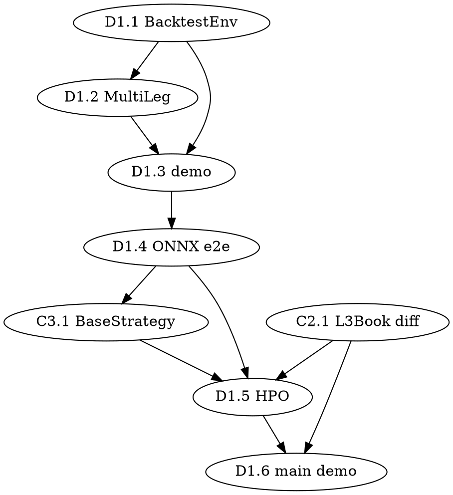

# axon_quant 0.9.0 Design — RL/HPO Training Productionization

> **Status**: Draft v1(待审)
> **Date**: 2026-07-22
> **Owner**: axon_quant work group
> **Parent plan**: [`2026-07-20-axon-quant-0.8.0-phase3.md`](2026-07-20-axon-quant-0.8.0-phase3.md) 后续 + 用户 0.9.0 规划
> **Base branch**: `0.9.0`(0.8.0 release 之后)

## Context

0.8.0 release 完成 matching layer 硬化(A2.1 Router / A1.1-1.3 Tracker / A3.1 Arena / A3.2 SoA / A3.3 tick latency gate)。
**`BacktestEngine` Python API 完整,撮合 + 撮合性能在 budget 内,但 RL 训练 / 端到端部署尚未串联**。

0.9.0 核心目标:**让 RL 训练生产化**(训练 → ONNX → BacktestEngine 部署 → 验收),覆盖 D1(RL/HPO)+ C2(L3Book streaming)+ C3(Python 策略抽象)三个 thread。

## 关键设计决策(用户确认)

| 维度 | 决策 |
|------|------|
| 范围 | D1(RL/HPO)+ C2(L3Book streaming)+ C3(Python BaseStrategy) |
| 主目标 | RL 训练生产化(C2/C3 辅佐) |
| RL 训练基础设施 | **复用 `axon-distributed` DistributedTrainer**(Ray RLLib PPO / SAC 完整集成) |
| HPO 基础设施 | **复用 `axon-hpo` OptunaHPO**(已支持单 / 多目标 + TPE / CMA-ES + pruner) |
| 推理基础设施 | **复用 `axon-inference::OnnxBackend` + `BatchInferencePipeline`** |
| 部署形态 | ONNX → `axon-inference::OnnxBackend` → `BacktestEngine` sim 决策 |
| 训练数据 | 仅 `BacktestEngine` 闭环(不接 `axon-data` / `axon-exchange` live) |
| 多 leg 架构 | 单 agent multi-output(2-3 leg 同步,2 leg 主验收) |
| HPO 规模 | 100 trial Optuna 本地 sweep(8-16 CPU,~1-3h) |
| 可视化 | TensorBoard(通过 SB3 / RLLib callback 集成) |

## 0.9.0 = 端到端胶水层(非基础设施重建)

| 已实现(0.9.0 不动) | 位置 |
|-------------------|------|
| `OnnxBackend` + ONNX 推理 + Candle / Tch 后备 | [`crates/axon-inference/src/backend/onnx.rs`](../../crates/axon-inference/src/backend/onnx.rs) |
| `BatchInferencePipeline` + `ModelHotReloader` | [`crates/axon-inference/src/pipeline/`](../../crates/axon-inference/src/pipeline/) |
| `Observation` / `Action` / `ActionType`(5 类离散) | [`crates/axon-inference/src/error.rs`](../../crates/axon-inference/src/error.rs) |
| `DistributedTrainer`(Ray RLLib PPO / SAC) | [`crates/axon-distributed/python/axon_distributed/ray_trainer.py`](../../crates/axon-distributed/python/axon_distributed/ray_trainer.py) |
| `OptunaHPO`(单 / 多目标 + sampler + pruner) | [`crates/axon-hpo/python/axon_hpo/optuna_runner.py`](../../crates/axon-hpo/python/axon_hpo/optuna_runner.py) |
| `StreamingStrategy` trait + `SmaCrossover` 示例 | [`crates/axon-backtest/src/streaming/strategy.rs`](../../crates/axon-backtest/src/streaming/strategy.rs) |
| `BacktestEngine` Python API + `RunResult` | [`python/axon_quant/backtest.py`](../../python/axon_quant/backtest.py) |

**0.9.0 新增范围** = 上表中 4 个缺口:

1. `BacktestEngine` 没有 gym.Env 协议包装(D1.1)
2. ONNX 训练产物的 multi-output action 适配 + BacktestEngine 决策(D1.2 / D1.4)
3. `BacktestEngine` 没有 L3Book streaming 增量回调(C2.1)
4. Python 侧没有 `BaseStrategy` 抽象 / `OptunaHPO` 未接 RL 训练 / demo 主验收(C3.1 / D1.5 / D1.6)

## 范围(本 plan 覆盖)

### 7 个交付子项(按依赖链排序)

```
D1.1 ─→ D1.2 ─→ D1.3 ─→ D1.4 ─→ C3.1 ─→ D1.5 ─→ D1.6
                                            ↑
                                  (C2.1 在 D1.5 前补上,
                                   D1.5 训练可视化需要 L3Book diff)
```

| # | 子项 | 周期 | 关键交付 | 依赖 |
|---|------|------|----------|------|
| **D1.1** | `BacktestEnv`(gym.Env 包装) | 1w | `python/axon_quant/env.py`:`BacktestEnv(gym.Env)` 包装 `BacktestEngine` 单 leg observation / action | 无 |
| **D1.2** | `MultiLegBacktestEnv`(多 leg 同步) | 1w | `MultiLegBacktestEnv(BacktestEnv)`:`_build_obs` concat 多 leg obs + position + cash;action_space 扩为 2-3 leg 同步 | D1.1 |
| **D1.3** | RL 训练收敛 demo | 1w | `CartPole 5K 收敛`(RLLib 验证分布式路径)+ `spot 单 leg PPO 50K 收敛`(SB3 验证单进程路径) | D1.1, D1.2 |
| **D1.4** | ONNX 导出 + 端到端部署 | 1w | `RLTrainer.export_onnx()` 工具 + `OnnxPolicyStrategy` 适配器;e2e:RL 训练 → 导出 → `OnnxBackend` 加载 → `BacktestEngine` sim 跑通 | D1.3, 现有 `OnnxBackend` |
| **C3.1** | Python `BaseStrategy` 抽象 | 0.5w | `python/axon_quant/strategy/base.py`:`BaseStrategy(ABC)` 多 leg 决策接口(对应 Rust 侧 `StreamingStrategy` 的 Python 镜像) | D1.4 |
| **C2.1** | L3Book streaming 增量更新 | 1w | Rust 侧:`BacktestEngine::subscribe(&mut callback)` 推送 `L3BookDiff`;Python 侧通过 `BacktestEngine` 绑定接收 | 无 |
| **D1.5** | HPO 集成(Optuna) + TensorBoard | 1.5w | `HPOSweeper`(基于 `OptunaHPO`)胶水 + SB3 / RLLib `tensorboard_log` callback + 100 trial sweep spot+perp | D1.4, 现有 `OptunaHPO` |
| **D1.6** | spot+perp 套利 demo(主验收) | 1w | 端到端:训练 → 导出 → 部署 → `BacktestEngine` 跑策略 → 验收 PnL 收敛 + Sharpe | D1.5, C2.1, C3.1 |

**总周期 ~8 周**。

### 各子项设计要点

#### D1.1 — `BacktestEnv`(gym.Env 包装)

```python
# python/axon_quant/env.py
class BacktestEnv(gym.Env):
    """BacktestEngine 的 gym.Env 协议包装(单 leg observation)。"""

    metadata = {"render_modes": ["human"]}

    def __init__(
        self,
        instrument: InstrumentDict,
        initial_cash: float = 100_000.0,
        seed: int | None = None,
    ) -> None:
        self.instrument = instrument
        self.engine = _native_backtest.BacktestEngine(initial_cash=initial_cash)
        self.observation_space = spaces.Box(
            low=-np.inf, high=np.inf,
            shape=(OBS_DIM_SINGLE_LEG,),  # 默认 64: 32 价格 + 32 数量
            dtype=np.float32,
        )
        self.action_space = spaces.Box(
            low=-1.0, high=1.0, shape=(1,),  # 单 leg delta qty 归一化
            dtype=np.float32,
        )

    def reset(self, *, seed: int | None = None, options: dict | None = None) -> tuple[Obs, Info]:
        ...

    def step(self, action: np.ndarray) -> tuple[Obs, float, bool, bool, Info]:
        ...
```

**关键设计**:
- `observation_space` shape 由 `instrument` 决定(spot vs swap schema 不同,默认 spot 32+32)
- `action` ∈ [-1, 1] 归一化调仓量,内部映射到 `set_target_position` qty 范围
- `reward` 默认 = `bar_nav_curve` 末帧 NAV 差分 / `initial_cash`(后续 D1.5 改成 reward function plugin)
- `seed` 透传 `BacktestEngine`(0.9.0 新增 `BacktestEngine::with_seed(u64)` builder)

#### D1.2 — `MultiLegBacktestEnv`(2-3 leg 同步)

```python
class MultiLegBacktestEnv(BacktestEnv):
    """多 leg observation / action 拼接(2-3 leg 同步)。"""

    def __init__(self, legs: list[LegSpec], initial_cash: float = 100_000.0):
        # legs: list[(instrument_dict, target_qty_scale)]
        # 默认 2 leg: spot + perp(套利场景)
        super().__init__(legs[0][0], initial_cash)  # primary
        self.legs = legs
        self.observation_space = spaces.Box(
            low=-np.inf, high=np.inf,
            shape=(OBS_DIM_SINGLE_LEG * len(legs) + 2 * len(legs) + 1,),  # obs + position + cash
            dtype=np.float32,
        )
        self.action_space = spaces.Box(
            low=-1.0, high=1.0, shape=(len(legs),),  # 每 leg 一个 [-1, 1]
            dtype=np.float32,
        )

    def _build_obs(self) -> np.ndarray:
        # concat 各 leg order book obs + 各 leg position + cash
        # obs shape: (OBS_DIM_SINGLE_LEG * len(legs) + 2 * len(legs) + 1,)
        #   - 各 leg OBS_DIM_SINGLE_LEG bytes: 2 * 32(price + qty)
        #   - 2 * len(legs) bytes: 每 leg 2 个 position 字段(spot_qty, perp_qty)
        #   - 1 byte: cash 归一化
        ...
```

**关键设计**:
- 单 agent multi-output(SB3 训练,`flatten_action` 自动)
- 2 leg 主验收,3 leg 设计兼容(代码路径支持,benchmark 走 2)
- `MultiLegAction` 结构(0.9.0 新增 Rust 类型,扩展现有 `Action`):

```rust
// crates/axon-inference/src/types.rs(0.9.0 新增)
#[derive(Debug, Clone, Serialize, Deserialize)]
pub struct MultiLegAction {
    /// 各 leg 目标仓位(归一化 [-1, 1]),长度 = leg 数
    pub target_positions: Vec<f32>,
    /// 0.9.0 demo:全 Hold 视为 0 / 全 Buy 视为 1 / 全 Sell 视为 -1(向后兼容离散 ActionType)
    pub model_id: String,
    pub inference_time_us: u64,
}
```

#### D1.3 — RL 训练收敛 demo

```python
# python/axon_quant/env_training.py(0.9.0 新增)
from axon_quant.env import MultiLegBacktestEnv
from axon_quant.backtest import spot_instrument, swap_instrument
from axon_distributed import DistributedTrainer, RLLibTrainConfig, RayConfig
from gymnasium.envs.classic_control import CartPoleEnv

# Step 1: CartPole smoke test(5K 收敛)
def train_cartpole():
    trainer = DistributedTrainer(
        ray_config=RayConfig(num_workers=1, num_cpus_per_worker=1),
        train_config=RLLibTrainConfig(
            algorithm=Algorithm.PPO,
            env="CartPole-v1",
            framework="torch",
            train_batch_size=4000,
            sgd_minibatch_size=128,
            lr=1e-4,
        ),
        init_ray=True,
    )
    algo = trainer.build_algo()
    for i in range(10):
        result = algo.train()
        if result["episode_reward_mean"] > 475:
            print(f"CartPole converged at iter {i}")
            break

# Step 2: spot 单 leg PPO 50K 收敛
def train_spot_single_leg():
    spot = spot_instrument("BTC", "USDT")
    env = BacktestEnv(spot)
    # ... 用 SB3 PPO 直接训练(不通过 RLLib,RLLib 是分布式场景,单进程用 SB3 更轻)
    from stable_baselines3 import PPO
    model = PPO("MlpPolicy", env, verbose=1, tensorboard_log="./tb_logs/")
    model.learn(total_timesteps=50_000)
    model.save("artifacts/spot_single_leg_ppo.zip")
```

**关键设计**:
- **两层训练路径**:
  - **分布式** → `axon-distributed.DistributedTrainer`(RLLib)支持多 worker / GPU,用于 CartPole 烟雾测试验证 RLLib 集成 OK
  - **单进程** → `stable-baselines3.PPO`(已有 `rl` extra)用于 D1.6 主验收(单进程 demo 够用,RLLib overhead 反而高)
- CartPole 是 RLLib 路径的 sanity check(用 `axon_distributed.DistributedTrainer`),真正验收看 spot 单 leg 50K 收敛(用 SB3)
- TensorBoard 通过 `tensorboard_log=Path` 参数注入(SB3 / RLLib 原生支持)

#### D1.4 — ONNX 导出 + 端到端部署

```python
# python/axon_quant/training/export.py(0.9.0 新增)
def export_onnx(model: BaseAlgorithm, path: Path, obs_sample: np.ndarray) -> Path:
    """SB3 policy → ONNX。"""
    import torch.onnx
    policy = model.policy
    torch.onnx.export(
        policy,
        (torch.from_numpy(obs_sample).float(),),
        str(path),
        input_names=["obs"],
        output_names=["action"],
        dynamic_axes={"obs": {0: "batch"}, "action": {0: "batch"}},
        opset_version=17,
    )
    return path

# python/axon_quant/strategy/onnx_policy.py(0.9.0 新增)
from axon_quant.inference import create_onnx_engine, ModelConfig, InferenceBackend, Device

class OnnxPolicyStrategy(BaseStrategy):
    """ONNX policy → BaseStrategy 适配器(部署时使用)。"""

    def __init__(self, onnx_path: Path, leg_specs: list[LegSpec]):
        # 加载 ONNX 到 axon-inference OnnxBackend(已有)
        self.engine = create_onnx_engine(
            model_path=str(onnx_path),
            input_shape=(1, 1, obs_dim),  # (batch, seq, feature) 与导出时一致
            output_dim=action_dim,
        )
        self.leg_specs = leg_specs

    def on_bar(self, bar: Bar, ctx: StrategyContext) -> list[Order]:
        obs = self._build_obs(bar, ctx)  # 多 leg 拼接
        # 走现有 OnnxBackend,返回 MultiLegAction
        multi_leg = self.engine.infer_multi_leg(obs, len(self.leg_specs))
        return self._action_to_orders(multi_leg, bar, ctx)
```

**关键设计**:
- **复用** `axon-inference::OnnxBackend`(已有),新增 1 个方法 `infer_multi_leg(obs, n_legs) -> MultiLegAction`(扩展现有 5 类 `decode_action`)
- ONNX 导出用 PyTorch 原生 `torch.onnx.export`,不引入 `sk2onnx` / `onnx-sb3` 等第三方(避免版本耦合)
- `OnnxPolicyStrategy` 是部署专用,内部直接用 `_native_inference_module.OnnxBackend`,不走 `_native` 单独 import

#### C3.1 — Python `BaseStrategy` 抽象

```python
# python/axon_quant/strategy/base.py(0.9.0 新增)
from abc import ABC, abstractmethod
from typing import TYPE_CHECKING

if TYPE_CHECKING:
    from axon_quant.backtest import OrderDict, InstrumentDict
    from axon_quant.env import Bar, StrategyContext

class BaseStrategy(ABC):
    """多 leg 策略抽象(Python 镜像 Rust 侧 StreamingStrategy)。"""

    @abstractmethod
    def on_bar(self, bar: "Bar", ctx: "StrategyContext") -> list["OrderDict"]:
        """每 bar 调用一次,返回应执行的订单列表。"""

    @abstractmethod
    def on_fill(self, fill: "FillDict", ctx: "StrategyContext") -> list["OrderDict"]:
        """每 fill 调用一次(可选,默认 no-op)。"""
        return []
```

**关键设计**:
- 镜像 Rust 侧 `StreamingStrategy` trait([`crates/axon-backtest/src/streaming/strategy.rs`](../../crates/axon-backtest/src/streaming/strategy.rs))
- 0.9.0 不强求多 leg 抽象对称(单 leg `BaseStrategy` 也能用,单 leg 用 `on_bar(instrument=...)` 透传)
- Python 侧类型注解都走 TYPE_CHECKING,避免 import 循环

#### C2.1 — L3Book streaming 增量更新

**Rust 侧新增**:
```rust
// crates/axon-backtest/src/engine.rs(0.9.0 新增)
pub struct L3BookDiff {
    pub instrument: Instrument,
    pub added: Vec<L3Order>,     // 新增挂单
    pub removed: Vec<u64>,       // 取消 / 完全成交的 order_id
    pub modified: Vec<L3Order>,  // 部分成交后剩余
    pub timestamp_ns: i64,
}

pub trait L3BookSubscriber: Send {
    fn on_diff(&mut self, diff: &L3BookDiff);
}

impl BacktestEngine {
    pub fn subscribe(&mut self, subscriber: Box<dyn L3BookSubscriber>) { ... }
    pub fn unsubscribe(&mut self, id: SubscriberId) { ... }
    fn compute_diff(&self, prev: &BTreeMap<...>, curr: &BTreeMap<...>) -> L3BookDiff { ... }
}
```

**Python 侧**:通过 `BacktestEngine` PyO3 绑定接收 `L3BookDiff`(每 bar 末触发)

**关键设计**:
- 增量 diff 走 `BTreeMap<Price, Vec<L3Order>>` 全比较(prev/curr),O(n) where n = L3Book size
- 0.8.0 已加 `L3Book` 视图,本子项只加 `subscribe` + `L3BookDiff` 增量
- **触发时机**:
  - 每 bar 末(`begin_bar` / `begin_bar_multi` 收尾时)推 1 个 `L3BookDiff`
  - 每 fill 发生时再推 1 个 `L3BookDiff`(用户可在 subscribe 时选订阅粒度:`SubscriberKind::PerBar` / `PerFill` / `Both`,默认 `PerBar`)
- L3Book diff **不是** 0.9.0 主路径,只为 D1.5 训练可视化 + TensorBoard 实时观察策略决策

#### D1.5 — HPO 集成(Optuna) + TensorBoard

```python
# python/axon_quant/training/hpo_sweeper.py(0.9.0 新增)
from axon_hpo import OptunaHPO, SearchSpaceDef, SamplerConfig

class RLHPOSweeper:
    """RL 训练的 HPO 胶水(基于 axon-hpo OptunaHPO)。"""

    def __init__(self, n_trials: int = 100, study_name: str = "rl_hpo"):
        self.sweeper = OptunaHPO(
            search_space={
                "lr": SearchSpaceDef.log_uniform(1e-5, 1e-3),
                "gamma": SearchSpaceDef.uniform(0.9, 0.9999),
                "clip_param": SearchSpaceDef.uniform(0.1, 0.4),
                "entropy_coeff": SearchSpaceDef.log_uniform(1e-4, 1e-1),
            },
            objective_fn=self._objective,
            study_name=study_name,
            directions="maximize",  # maximize Sharpe
            sampler=SamplerConfig(sampler_type="tpe", n_startup_trials=20),
        )

    def _objective(self, params: dict) -> list[float]:
        env = make_env()  # 工厂
        model = PPO("MlpPolicy", env, **params, tensorboard_log=f"./tb_logs/{params_hash}/")
        model.learn(total_timesteps=50_000)
        sharpe = compute_sharpe(env, model)
        return [sharpe]

    def sweep(self) -> dict:
        results = self.sweeper.run(n_trials=100)
        return results.best_config
```

**关键设计**:
- **复用** `axon-hpo::OptunaHPO`,**不**接 ray[tune](原计划修正)
- **并发模型**:`OptunaHPO` 默认串行 trial,0.9.0 改成 **8-CPU 并发**(每 trial 单进程 SB3,Optuna study 跨进程用 `storage="sqlite:///optuna.db"` 同步)
  - 100 trial / 8-CPU 并发 = ~12-13 批 × 单 trial 时间,单 trial 50K timesteps ~5-10min → 总时间 ~1-1.5h
  - 原估算 1-3h 是串行时间(100 × 5min = 500min ≈ 8h),并发后 1-1.5h
- 每 trial 跑 50K timesteps,每 trial 独立 TensorBoard 目录(`./tb_logs/trial_<id>/`)
- trial 失败(SB3 NaN / 崩)→ Optuna `TrialPruned` / metric = -inf,sweeper 跳过,best_config 选成功 trial 中 metric 最佳

#### D1.6 — spot+perp 套利 demo(主验收)

**端到端脚本**:
```python
# examples/rl/spot_perp_arb_demo.py(0.9.0 新增)
def main():
    # 1. 训练
    spot = spot_instrument("BTC", "USDT")
    perp = swap_instrument("BTC", "USDT")
    env = MultiLegBacktestEnv([(spot, 1.0), (perp, 1.0)])
    model = PPO("MlpPolicy", env, verbose=1, tensorboard_log="./tb_logs/spot_perp_arb/")
    model.learn(total_timesteps=100_000)

    # 2. 导出 ONNX
    obs_sample = env.observation_space.sample()
    export_onnx(model, Path("artifacts/spot_perp_arb.onnx"), obs_sample)

    # 3. 部署到 BacktestEngine
    strategy = OnnxPolicyStrategy(
        onnx_path=Path("artifacts/spot_perp_arb.onnx"),
        leg_specs=[(spot, 1.0), (perp, 1.0)],
    )

    # 4. 验收
    bt = BacktestEngine(initial_cash=100_000.0)
    bt.with_seed_liquidity(half_spread=0.1, depth_levels=5, size_per_level=0.1)
    strategy.bind(bt)  # 注入
    result = bt.run()
    sharpe = compute_sharpe(result.bar_nav_curve)
    assert sharpe > 1.0, f"Sharpe {sharpe:.3f} < 1.0"
    print(f"PASS: Sharpe={sharpe:.3f}")
```

### 关键文件路径

| 子项 | 新增文件 | 既有依赖 |
|------|----------|----------|
| D1.1 | `python/axon_quant/env.py` | `axon_quant.backtest`, `gymnasium` |
| D1.2 | `python/axon_quant/env.py`(同 D1.1) | D1.1 |
| D1.3 | `examples/rl/train_demo.py` | `axon_quant.env`, `stable-baselines3`, `axon_distributed` |
| D1.4 | `python/axon_quant/training/{export,onnx_policy}.py` | D1.3, `axon_quant.inference` |
| C3.1 | `python/axon_quant/strategy/base.py` | `axon_quant.backtest` 类型 |
| C2.1 | Rust:`crates/axon-backtest/src/streaming/l3_diff.rs` + `engine.rs` 扩展 | 现有 `L3Book` |
| D1.5 | `python/axon_quant/training/hpo_sweeper.py` | `axon-hpo`, SB3 |
| D1.6 | `examples/rl/spot_perp_arb_demo.py` | D1.4, D1.5, C2.1, C3.1 |

## 数据流

### 训练流(D1.1 → D1.5)

```text
┌─────────────────────────────────────────────────────────────┐
│  训练时(offline)                                              │
│                                                               │
│  MultiLegBacktestEnv(D1.2)                                    │
│      │  reset(seed=...)                                       │
│      │    ├─→ BacktestEngine::with_seed(seed).reset()(D1.1)  │
│      │    └─→ 返回 initial obs(concat 多 leg orderbook + pos) │
│      │  step(action)                                          │
│      │    ├─→ action_to_orders():把 [-1, 1] 归一化 → qty+side │
│      │    ├─→ BacktestEngine::set_target_position(per_leg)   │
│      │    ├─→ engine.begin_bar(price, instrument)            │
│      │    ├─→ engine.run()                                    │
│      │    └─→ 返回 (next_obs, reward, done, info)             │
│      │                                                        │
│      ▼                                                        │
│  SB3 PPO model (D1.3) ──→ 收敛后 → policy.zip                 │
│      │  export_onnx(D1.4)                                     │
│      ▼                                                        │
│  artifacts/spot_perp_arb.onnx                                │
└─────────────────────────────────────────────────────────────┘
```

### 部署流(D1.4 端到端)

```text
┌─────────────────────────────────────────────────────────────┐
│  部署时(sim, BacktestEngine 内)                                │
│                                                               │
│  OnnxPolicyStrategy(C3.1)                                     │
│      │  on_bar(bar, ctx)                                      │
│      │    ├─→ 构造 obs = _build_obs(bar, ctx)                 │
│      │    ├─→ OnnxPolicyStrategy.engine.infer(obs)            │
│      │    │      └─→ axon-inference OnnxBackend.forward      │
│      │    ├─→ 拿到 MultiLegAction(target_positions: Vec<f32>) │
│      │    └─→ 各 leg target_positions[i] → set_target_position│
│      │                                                        │
│      ▼                                                        │
│  BacktestEngine::run()                                        │
│      ├─→ engine.submit(orders) → 撮合                        │
│      └─→ fill → engine state 更新                             │
│                                                               │
│  L3Book streaming(C2.1)                                      │
│      └─→ BacktestEngine::subscribe(callback)                  │
│         → 每 bar 末推 L3BookDiff → 训练可视化 / TensorBoard  │
└─────────────────────────────────────────────────────────────┘
```

### HPO 流(D1.5)

```text
OptunaHPO (axon-hpo)
   │
   ├─→ trial 1: PPO(lr=1e-4, gamma=0.99, ...) → train 50K → Sharpe
   ├─→ trial 2: PPO(lr=3e-4, gamma=0.995, ...) → train 50K → Sharpe
   ├─→ ... 100 trial
   └─→ best_config → 用 D1.6 主验收跑 100K + Sharpe 报告
```

## 错误处理(7 类边界)

| # | 边界 | 处理 |
|---|------|------|
| **E1** | `BacktestEngine` step 时无对手方(fill = 0) | `info: dict` 记零奖励,reward = 0(不崩) |
| **E2** | ONNX 导出失败(SB3 policy 算子不兼容) | `ExportError` 显式错误,带算子名 / 错误栈 |
| **E3** | ONNX 加载失败(文件损坏 / shape 不对) | `InferenceError.DimensionMismatch` 启动时 fail-fast,带 expected / actual dim |
| **E4** | 训练 obs 与部署 obs shape 不一致 | `MultiLegBacktestEnv` + `OnnxPolicyStrategy` 双向 assert,启动时 panic with clear message |
| **E5** | HPO trial 失败(SB3 NaN / 崩) | Optuna `TrialPruned` / metric = -inf,sweeper 跳过,best_config 选成功 trial 中 metric 最佳 |
| **E6** | `BacktestEngine` reset seed 与训练 seed 不一致 | `BacktestEngine::with_seed(u64)` builder 0.9.0 新增,Python `gym.Env.reset(seed=...)` 透传 |
| **E7** | L3Book streaming callback 抛异常 | callback wrapper try-catch,记 log,继续,不让一个失败 callback 拖死整个回测 |

## 测试策略

| 层 | 类型 | 数量 | 关键 case |
|---|------|------|-----------|
| **L1: 单元** | 组件 | 60-80 | `BacktestEnv.reset_returns_correct_shape` / `MultiLegBacktestEnv._build_obs_concat_legs` / `OnnxPolicyStrategy.on_bar_calls_predict_with_correct_obs` / `HPOSweeper.sweep_runs_n_trials` / `L3BookDiff_compute_added_removed_modified` |
| **L2: 集成** | 跨组件 | 15-20 | `env_step_triggers_engine_submit` / `export_onnx_round_trip` / `OnnxPolicyStrategy_to_BacktestEngine_e2e_sim` / `HPO_sweep_best_config_improves_over_baseline` / `L3Book_subscribe_receives_diff_per_bar` |
| **L3: 端到端** | 全链路 | 5-8 | `cartpole_ppo_5k_converges` / `spot_single_leg_ppo_50k_converges_and_exports` / `spot_perp_arb_ppo_100k_trains_hpo_exports_deploys` / `onnx_deploy_in_backtest_engine_runs` / `hpo_100_trials_completes_under_3_hours` / `l3book_subscribe_callback_counts_match_fills` |
| **L4: 性能 gate** | bench | 3-5 | `training_step_throughput`(env step/sec,目标 ≥ 500)/ `onnx_predict_latency_p99`(目标 < 1ms)/ `hpo_sweep_wall_time`(100 trial < 3h on 8 CPU)/ `l3book_diff_compute_latency`(L3Book 1000 档 < 100µs) |

## 验收标准(D1.6 主验收)

| 指标 | 目标 | 失败标准 |
|------|------|----------|
| **训练收敛** | spot+perp 套利策略在 100K timesteps 内 Sharpe > 1.0 | 100K 不收敛 → 调 reward function / observation schema |
| **HPO 增益** | 100 trial sweep 后 best_config 相比 baseline 配置,Sharpe 提升 ≥ 20% | 提升 < 10% → 扩 search_space |
| **ONNX e2e** | 导出的 .onnx 加载到 BacktestEngine 后,sim PnL 与 Python SB3 模拟 PnL 误差 < 5% | 误差 > 10% → 浮点精度 / observation schema 偏移 |
| **HPO 性能** | 100 trial 8-CPU 跑完 ≤ 3 小时 | 超过 3h → 缩 search space 或单 trial timesteps |
| **L3Book streaming** | 训练 / 部署过程中 callback 触发次数 == 总 fill 数 + rebalance 数 | 不等 → diff 算法有 bug |
| **文档** | `docs/zh/user-guide/rl-training.md` + 英文版完整 | 不完整 → 不发版 |

## 范围外(明确不做)

- 真实数据源接入(0.9.0 不接 `axon-data` / `axon-exchange` live,BacktestEngine 闭环)
- multi-agent 协同(SAC / MAPPO → 0.10.0 评估)
- 3+ leg 训练(2-3 leg 同步可扩展,但只 demo 2 leg)
- K8s / 多机 ray cluster
- 实时部署到 axon-oms(只到 BacktestEngine sim 部署)
- `wandb` 集成(0.9.0 只用 TensorBoard)

## 风险 + 缓解

| 风险 | 等级 | 缓解 |
|------|------|------|
| SB3 policy.onnx 导出算子不兼容(some custom layer) | 中 | 0.9.0 限制使用 SB3 标准 MlpPolicy(0.9.0 验收);复杂 model → 0.10.0 评估 |
| ONNX 推理精度漂移(fp32 → ONNX → 推理) | 低 | D1.4 验收加 sim PnL 误差 < 5% gate,失败回溯 |
| 训练 obs schema 与部署 obs schema 不一致 | 中 | 双向 assert + 共享 `_build_obs` 工厂函数 |
| L3Book diff 算法 O(n²) | 低 | 1000 档 < 100µs gate(常规 bar 100-200 档,远低于) |
| Optuna study 跨进程持久化 | 中 | 用 `storage="sqlite:///optuna.db"`,跨进程共享 study |
| ONNX e2e 部署时序问题(BacktestEngine state 不连续) | 中 | `OnnxPolicyStrategy.bind(bt)` 显式注入,部署时一次性 init |

## 实施顺序与依赖图



**关键路径**:D1.1 → D1.2 → D1.3 → D1.4 → D1.5 → D1.6(8 周)
**辅佐**:C3.1 / C2.1 可在主路径前进时并行(不阻塞关键路径)

## 元数据

- **目标版本**:0.9.0
- **总周期**:~8 周
- **子项数**:7
- **新增 Rust 代码**:~500-800 LOC(engine.rs subscribe / MultiLegAction / L3BookDiff)
- **新增 Python 代码**:~1500-2000 LOC(env / strategy / training / examples)
- **新增文档**:`docs/zh/user-guide/rl-training.md` + 英文版 + Phase 4 计划 doc
